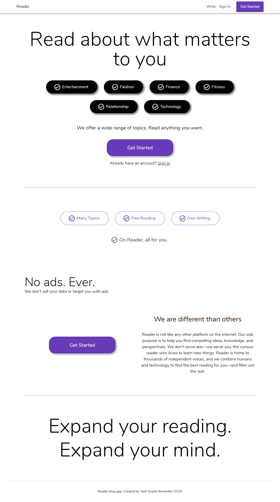
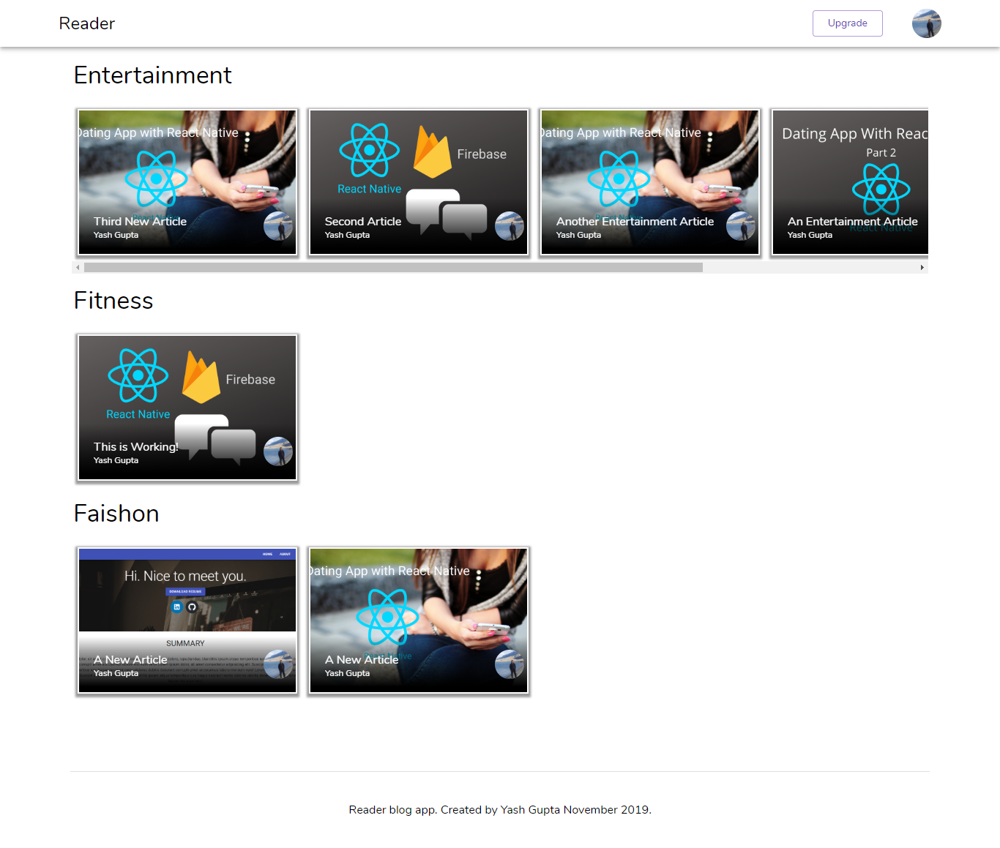
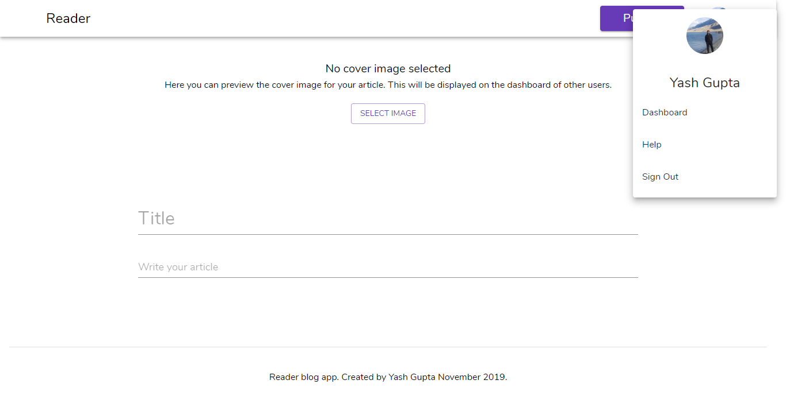
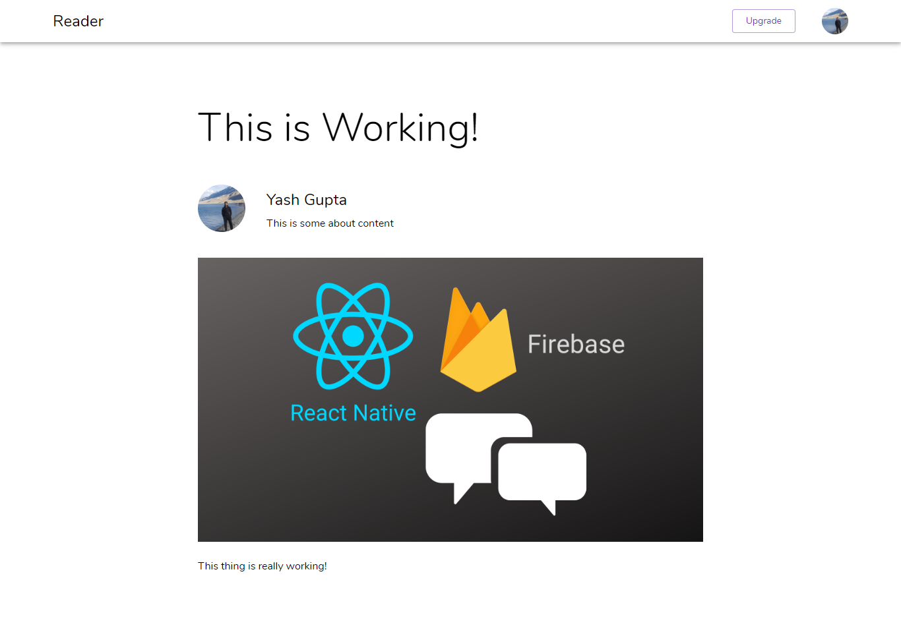

# Reader-React Project

Reader front end, created with React.js and Material UI. 

Visit at https://yashg160.github.io/Reader

**Note: The project has been left in an unusable state. I have included screenshots from the local development server below.**

## Screenshots

Home screen of the app. Appears when you first open the app.

The dashboard for the user. It shows blogs to read, in various categories like entertainment, faishon, finance, relationship and sports.

Page where a user can write a new article.

A sample article to show how an article appears on the webpage

